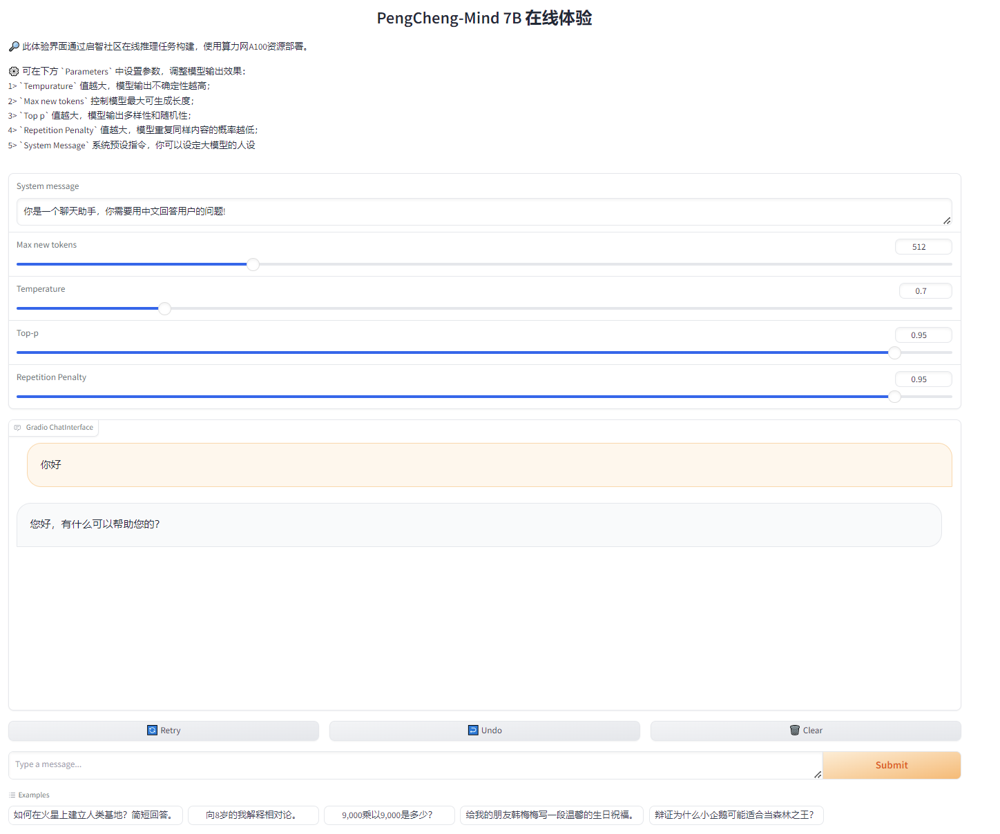
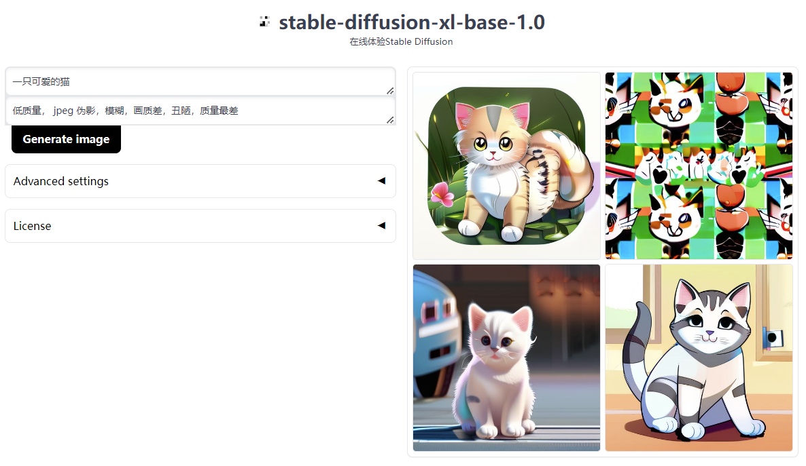

## OpenI 在线推理部署示例

**使用在线推理提供webui或api服务时需要了解以下几点：**

1. **平台没有对外直接提供端口如：7860 对外提供服务，可以使用fastapi转发到对外暴露的指定的URL(环境变量可获取：os.getenv('OPENI_SELF_URL'))提供服务。**
   **webui服务参考：**

   ```
   app = gr.mount_gradio_app(app, block, path=os.getenv('OPENI_SELF_URL')) 
   ```

   **api服务参考：**

   ```
   base_url = os.getenv('OPENI_SELF_URL')

   @app.post(os.path.join(base_url,"text2image"))
   ```
2. **服务启动指令参考：**

   ```
   uvicorn.run(app, host='0.0.0.0', port=int(os.getenv('OPENI_SELF_PORT')))
   ```
3. **在线推理任务只有在任务终止状态下才有日志返回。**


### 一. 鹏城脑海大模型PCMIND在线推理服务示例

参考[鹏城脑海PCMIND在线推理任务](./pcmind_7B_example/README.md)



### 二. Stable Diffusion在线推理服务示例

参考[启智stable-diffusion xl 在线推理任务](./stable_diffusion_example/README.md)


