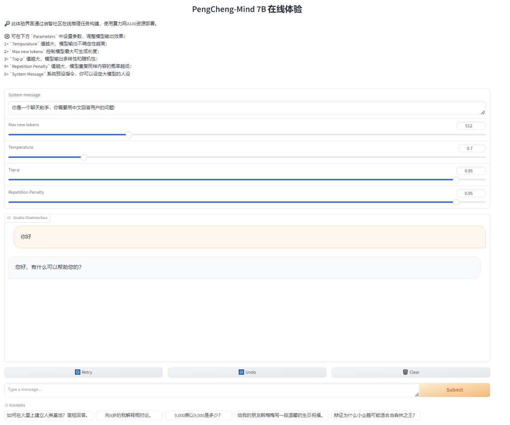

# 鹏城脑海大模型在线推理任务

本示例提供启智PCMIND大模型在线推理任务的webui方式和api方式

## 一. 在线推理鹏城脑海PCMIND  webui方式：

#### 1.创建PCMIND webui在线推理任务：

* 新建在线推理任务时选择以下参数：

  模型：[PCMind-7B-1T-Transformers](https://openi.pcl.ac.cn/yanghanshuo/Online_inference/modelmanage/model_readme_tmpl?name=PCMind-7B-1T-Transformer)
  资源规格：1 * V100
  镜像：192.168.204.22:5000/default-workspace/99280a9940ae44ca8f5892134386fddb/image:Llama3

  启动文件：pcmind_7B_example/pcmind_7B_gradio.py

  创建任务界面如下：
* 
* 任务运行后，点击在线推理可查看服务界面如下：
* 

#### 2.webui推理服务的核心是以下代码：

```
#将Gradio的界面demo挂载到FastAPI应用程序app中，并使用环境变量OPENI_SELF_URL中指定的路径。
app = gr.mount_gradio_app(app, demo, path=os.getenv('OPENI_SELF_URL'))
uvicorn.run(app, host='0.0.0.0', port=int(os.getenv('OPENI_SELF_PORT')))
```

## 二. 在线推理鹏城脑海PCMIND api方式：

#### 1.创建PCMIND api在线推理任务：

* 新建在线推理任务时选择以下参数：
  模型：[PCMind-7B-1T-Transformers](https://openi.pcl.ac.cn/yanghanshuo/Online_inference/modelmanage/model_readme_tmpl?name=PCMind-7B-1T-Transformer)
  资源规格：1 * V100
  镜像：192.168.204.22:5000/default-workspace/99280a9940ae44ca8f5892134386fddb/image:Llama3
  启动文件：pcmind_7B_example/pcmind_fastapi.py

  创建任务界面如下：

  
* 任务运行后，点击在线推理可查看api服务地址：
  将推理地址最后面的 **?token** 替换成  **您自己定义的请求路由，比如/api/chat** ，即为api接口地址，例如 [https://mlunotebook.openi.org.cn/notebook_bff8721d68354db881d82a34c984dd6d_task0/api/chat](https://mlunotebook.openi.org.cn/notebook_bff8721d68354db881d82a34c984dd6d_task0/api/chat)

#### 2.api推理服务的核心是以下代码：

```
# 定义GET请求的路由
@app.get(os.getenv('OPENI_SELF_URL') + '/api/chat')
async def api_get():
    return "This is a GET request."

# 启动
uvicorn.run(app, host='0.0.0.0', port=int(os.getenv('OPENI_SELF_PORT')))
```
