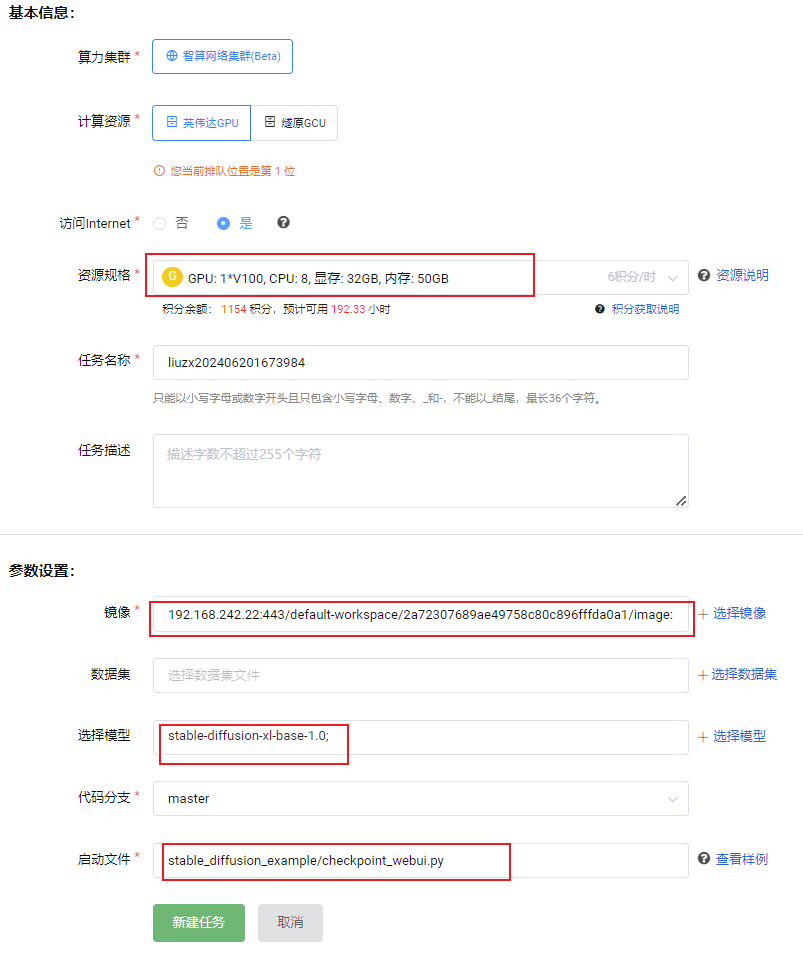
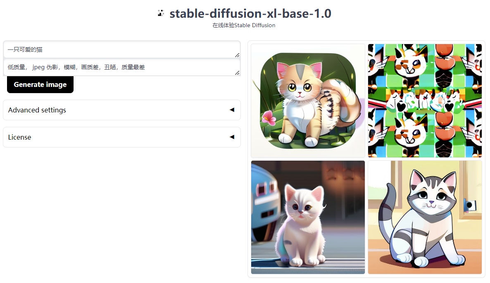
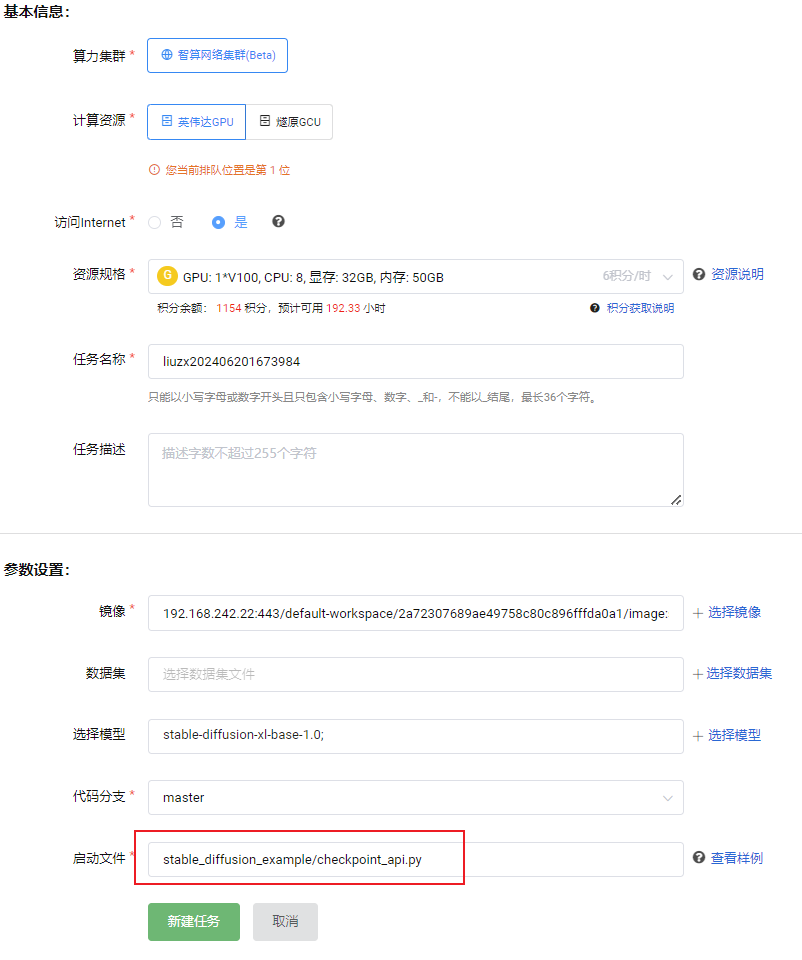

# 启智stable-diffusion xl 在线推理任务

本示例提供启智stable-diffusion xl 在线推理任务的webui方式和api方式

## 1. 在线推理stable-diffusion-xl  webui方式：

* 新建在线推理任务时选择以下参数：

  模型：可选择一个sd xl模型，如[stable-diffusion-xl-base-1.0](openi.pcl.ac.cn/FoundationModel/stabilityai/modelmanage/model_readme_tmpl?name=stable-diffusion-xl-base-1.0)
  资源规格：1 * V100
  镜像：192.168.242.22:443/default-workspace/2a72307689ae49758c80c896fffda0a1/image:stable-diffusion-api-webui-v3

  启动文件：stable_diffusion_example/checkpoint_webui.py

  创建任务界面如下：

  
* 任务运行后，点击在线推理可查看服务：

  界面如下：
* 

## 2. 在线推理stable-diffusion-xl  api方式：

* 新建在线推理任务时选择以下参数：
  模型：可选择一个sd xl模型，如[stable-diffusion-xl-base-1.0](openi.pcl.ac.cn/FoundationModel/stabilityai/modelmanage/model_readme_tmpl?name=stable-diffusion-xl-base-1.0)
  资源规格：1 * V100
  镜像：192.168.242.22:443/default-workspace/2a72307689ae49758c80c896fffda0a1/image:stable-diffusion-api-webui-v3
  启动文件：stable_diffusion_example/checkpoint_api.py
  创建任务界面如下：

  
* 任务运行后，点击在线推理可查看api服务地址：
  将推理地址最后面的 **?token** 替换成  **/text2image** ，即为api接口地址，例如 [https://mlunotebook.openi.org.cn/notebook_bff8721d68354db881d82a34c984dd6d_task0/text2image](https://mlunotebook.openi.org.cn/notebook_bff8721d68354db881d82a34c984dd6d_task0/text2image)

## 3. 可选的stable diffusion xl模型

以下是推荐的sd xl模型，只选一个，可先收藏此模型再选用：

[stable-diffusion-xl-base-1.0](https://openi.pcl.ac.cn/FoundationModel/stabilityai/modelmanage/model_readme_tmpl?name=stable-diffusion-xl-base-1.0) 或 [leosamsHelloworldXL_helloworldXL60](https://openi.pcl.ac.cn/FoundationModel/misri/modelmanage/model_readme_tmpl?name=leosamsHelloworldXL_helloworldXL60) 或 [AAM XL AnimeMix](https://openi.pcl.ac.cn/FoundationModel/Lykon/modelmanage/model_readme_tmpl?name=AAM_XL_AnimeMix)
